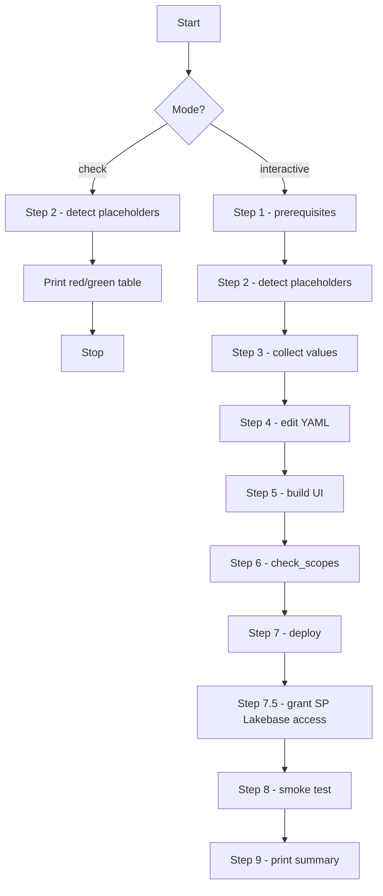

# Agent Hub Installation Helper

You are guiding a user through installing **Agent Hub** into their own Databricks workspace. The repo ships with placeholder values; the deployer must fill them in before `databricks bundle deploy` will succeed. This skill walks them through that process.

## Step 0 — Pick a mode

Ask the user which mode they want using whatever question/menu primitive your IDE exposes (`AskQuestion` in Cursor, `ask` in Claude Code, etc.):

- **interactive** — collect inputs, validate them, edit the YAML files in place, then build + deploy.
- **check** — read-only audit of the working tree; report what's still placeholder and how to fix each one. Do **not** modify any file.

If the user hasn't said which one, default to **check** first (safer), then offer to switch to **interactive** once they've reviewed the gaps.

## Step 1 — Verify prerequisites

Run each command, capture stdout, and confirm it succeeds. If any one is missing or fails, stop and link the user to the install page:

| Tool | Probe | If missing |
|---|---|---|
| Databricks CLI ≥ 0.240 | `databricks --version` | https://docs.databricks.com/dev-tools/cli/install.html |
| `uv` (Python pkg manager) | `uv --version` | https://docs.astral.sh/uv/ |
| `bun` ≥ 1.2 (or `node` ≥ 20) | `bun --version` | https://bun.sh/ |
| Authenticated profile | `databricks auth profiles` (parse JSON; need at least one entry) | `databricks auth login --host https://<workspace>.cloud.databricks.com --profile <name>` |

## Step 2 — Detect placeholders

The two files that need editing are [`app.yaml`](../../../app.yaml) and [`databricks.yml`](../../../databricks.yml). Grep for the placeholder pattern `<your-...>` (or `<workspace-id>` / `<bootstrap-admin>`):

```bash
grep -nE '<your-[a-z-]+>|<workspace-id>|<bootstrap-admin>' app.yaml databricks.yml
```

Expected placeholders on a fresh clone:

| File | Field | Placeholder |
|---|---|---|
| `app.yaml` | `LAKEBASE_PROJECT_ID` | `<your-lakebase-project>` |
| `app.yaml` | `BOOTSTRAP_ADMIN_EMAILS` | `<your.email>@<your-domain>` |
| `app.yaml` | `AGENT_HUB_ADMIN_WAREHOUSE_ID` | `<your-warehouse-id>` |
| `databricks.yml` | `variables.workspace_host.default` | `https://<your-workspace>.cloud.databricks.com` |
| `databricks.yml` | `targets.dev.workspace.host` | `https://<your-workspace>.cloud.databricks.com` |
| `databricks.yml` | `targets.dev.workspace.profile` | `<your-profile>` |
| `databricks.yml` | `targets.prod.workspace.host` | `https://<your-workspace>.cloud.databricks.com` |
| `databricks.yml` | `targets.prod.workspace.profile` | `<your-profile>` |

If **check mode**: print this table with green/red status per row and exit. Do not proceed to step 3.

## Step 3 — Collect values (interactive mode only)

For each placeholder, ask the user. Where possible, *suggest* a value by querying the workspace first.

### profile
```bash
databricks auth profiles -o json | python3 -c "import json,sys; print('\n'.join(p['name'] for p in json.load(sys.stdin)['profiles']))"
```
Show the list; ask the user to pick one. Validate by running `databricks workspace list / --profile <name>` — must return without error.

### workspace_host
Read from the chosen profile:
```bash
databricks auth env --profile <name> | grep DATABRICKS_HOST
```
If the user wants a different host, prompt them; otherwise use what the profile declares.

### app_name
Default suggestion: `agent-hub`. Ask the user; validate it matches `^[a-z][a-z0-9-]{2,30}$` (Databricks Apps slug rules).

### BOOTSTRAP_ADMIN_EMAILS
Default suggestion: the current user's email.
```bash
databricks current-user me --profile <profile> -o json | python3 -c "import json,sys; print(json.load(sys.stdin)['userName'])"
```
The value is comma-separated, so allow the user to add more.

### AGENT_HUB_ADMIN_WAREHOUSE_ID
List warehouses and let the user pick:
```bash
databricks warehouses list --profile <profile> -o json | python3 -c "import json,sys; [print(f\"{w['id']}\t{w['name']}\") for w in json.load(sys.stdin)['warehouses']]"
```
Validate with `databricks warehouses get <id> --profile <profile>`.

### LAKEBASE_PROJECT_ID
List existing Lakebase projects:
```bash
databricks lakebase list-projects --profile <profile> -o json 2>/dev/null
```
If none exist or the user wants a fresh one, instruct them to create it via:
- Workspace UI: **Compute → Lakebase → Create Project**
- Or CLI: `databricks lakebase create-project --name <slug> --profile <profile>`
Then re-prompt for the slug.

### LAKEBASE_BRANCH_ID
Default `production`. Only change if the user has a specific branch.

## Step 4 — Edit the files (interactive mode only)

Use string replacement, not freeform rewrites. The Databricks Apps runtime YAML parser is strict — preserve existing indentation, quoting, and comment placement. **Do not** insert comments between `env:` and the first `- name:` entry in `app.yaml` (silent-drop bug — see [`references/troubleshooting.md`](references/troubleshooting.md)).

For each placeholder, do an exact-string replace:

```python
# pseudo-code; use your IDE's edit tool
edit("app.yaml",
     old='value: "<your-lakebase-project>"',
     new=f'value: "{lakebase_project_id}"')
```

After editing, re-run the grep from Step 2. Zero matches means you're done.

## Step 5 — Build the UI

```bash
bun install
bun run build
```

Verify `src/agent_hub/__dist__/index.html` exists. If `bun` is missing, fall back to `npm install && npm run build`.

## Step 6 — Pre-deploy guard

```bash
python scripts/check_scopes.py
```

Exit code 0 means scopes are aligned. 1 means drift; ask the user to reconcile before continuing. 2 is the F5 reminder (users must revoke + re-consent after a scope change) — print it but proceed.

## Step 7 — Deploy

```bash
databricks bundle validate --target dev --profile <profile>
databricks bundle deploy   --target dev --profile <profile>
databricks bundle run      agent_hub --target dev --profile <profile>
```

If `bundle deploy` lands the app in `STOPPED | UNAVAILABLE`, run:

```bash
databricks apps start <app_name>-dev --profile <profile>
databricks bundle run agent_hub --target dev --profile <profile>
```

## Step 7.5 — Grant the app's service principal access to Lakebase

The first deploy creates a fresh service principal per app. That SP exists at the workspace level but is **not yet a postgres role inside your Lakebase project**, so the migration will fail with `password authentication failed for user '<sp-uuid>'` until you grant access.

Look up the SP UUID:

```bash
databricks apps get <app_name>-dev --profile <profile> -o json | python3 -c 'import json,sys; print(json.load(sys.stdin)["service_principal_client_id"])'
```

Open the Lakebase project in the workspace UI:

1. **Compute → Lakebase → `<lakebase_project_id>` → Roles**
2. Click **Add role** → paste the SP UUID
3. Grant `databricks_postgres` connect + `public` schema usage + table read/write

Or, if you prefer SQL (connect as the project owner via the Lakebase SQL editor):

```sql
CREATE ROLE "<sp-uuid>" WITH LOGIN;
GRANT CONNECT ON DATABASE databricks_postgres TO "<sp-uuid>";
GRANT USAGE   ON SCHEMA public                TO "<sp-uuid>";
GRANT ALL     ON ALL TABLES IN SCHEMA public  TO "<sp-uuid>";
ALTER DEFAULT PRIVILEGES IN SCHEMA public
  GRANT ALL ON TABLES TO "<sp-uuid>";
```

After granting, restart the app so the migration retries:

```bash
databricks apps stop  <app_name>-dev --profile <profile>
databricks apps start <app_name>-dev --profile <profile>
```

This step is one-time per `(app, lakebase_project)` pair — subsequent redeploys reuse the same SP.

## Step 8 — Smoke test

Print the app URL by reading `databricks apps get <app_name>-dev -o json --profile <profile>` and extracting `.url`.

```bash
TOKEN=$(databricks auth token --profile <profile> -o json | python3 -c 'import json,sys;print(json.load(sys.stdin)["access_token"])')
curl -sS -o /dev/null -w "%{http_code}\n" \
  -H "Authorization: Bearer $TOKEN" \
  "$APP_URL/api/v1/health/ready"
```

Expected: `200`. The body should include `{"db": {"ok": true, ...}}`.

Also tail the logs to confirm env propagation worked:

```bash
databricks apps logs <app_name>-dev --profile <profile> 2>&1 | grep -E 'Lakebase|LAKEBASE_PROJECT_ID'
```

You should see `Using Lakebase Autoscale project: <lakebase_project_id>` (the value the user set, not the placeholder).

## Step 9 — Done

Print:

```
[ok] Agent Hub deployed:
       App URL:        <app_url>
       Lakebase:       <project_id>/<branch_id>
       Bootstrap admin: <emails>
       Profile:         <profile>
Next steps:
  - First-time login: every user must consent to OAuth scopes (revoke + re-consent if scopes change later — see README §7).
  - Admin console: <app_url>/admin
  - Re-run this skill in `check` mode any time to verify configuration drift.
```

## Mode summary



## Troubleshooting

When any step fails, consult [`references/troubleshooting.md`](references/troubleshooting.md). It maps the most common error strings to their root cause and fix, distilled from real deployment incidents.

## Important rules

1. **Never commit the user's filled values to git.** The repo ships with placeholders intentionally. After deploy, the user can either keep their filled `app.yaml` / `databricks.yml` locally (gitignore is fine since they're already tracked, so just don't `git add` them) or use `databricks bundle` variable overrides via a `.databricks.user.env`.
2. **Quote every YAML value in `app.yaml` `env:`.** Unquoted hyphenated strings can be misparsed by the Apps runtime.
3. **Do not put comments between `env:` and the first `- name:`** — the Apps runtime YAML parser silently drops the entire env block. Comments after each item are fine.
4. **Validate every input** before writing to disk. A bad warehouse ID or a typo'd profile will fail at deploy time with cryptic errors; catching it in step 3 saves the user a redeploy cycle.
5. **In check mode, never modify files.** The user trusts check mode to be read-only.
