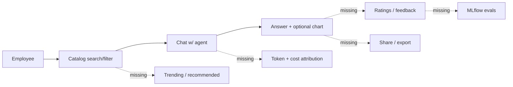

# SCGP Agent Chat Hub — Multi-Lens Review

Scope: read-only audit of `src/scgp_agent_hub/{backend,ui}`, `app.yaml`, `databricks.yml`, `docs/`, `scripts/`, `tests/`. No changes proposed for execution in this plan — it is an assessment with prioritized recommendations.

## 1. Executive Verdict (Chief AI Officer lens)

The app is a **well-architected v1** for surfacing Databricks AI assets (MAS, Knowledge Assistants, Genie Spaces, UC Functions, MCP endpoints) behind a unified chat UI with OBO auth, feature flags, pins, charts, and suggestions. It **partially** serves the "democratize AI self-service" mission.

- **Strong on plumbing**: OBO isolation, access checks with owner fallback, SSE streaming, admin discovery, per-user feature prefs.
- **Weak on the adoption flywheel**: no feedback loop (thumbs/ratings, trace links), no usage analytics, no cost/token attribution, no prompt library, no sharing/export, no evaluation/guardrails layer, no first-run education.
- Net: a **proficient chat client with governance**, but not yet an **"AI hub"** in the business sense — employees can chat with agents the admin already knows about; they cannot discover what works for their peers, improve agents with feedback, or show ROI.

## 2. Product Gaps for Self-Service Adoption (CAIO + UX)

Missing pieces that materially block "democratization":

- **No feedback loop on answers.** `message-bubble.tsx` (~187-214 actions row) has copy and pin but no thumbs up/down or structured feedback. Without this there is no quality signal, no way to improve prompts/agents, and no MemAlign / evaluation dataset.
- **No usage analytics surface.** Admin `admin.settings.tsx` shows only health; there is no "top agents", "questions per team", "failure rate", "avg latency", "cost per agent". The only telemetry table is `pin_events` in [`core/lakebase.py`](src/scgp_agent_hub/backend/core/lakebase.py) lines 250-261.
- **No cost / token attribution.** `messages.token_count` column exists in DDL but is never written. No usage tags on `/invocations`. No SBU/department chargeback dimension.
- **No prompt/template library.** Pins are per-user-per-agent only. There is no org-wide curated starter-question library, golden-question catalog per agent, or team-shared prompts.
- **No sharing or export.** Conversations cannot be shared (URL exists but no "copy link" UX, no ACL), cannot be exported to Markdown/PDF, cannot be sent to a notebook. Charts have PNG/CSV export only ([`echart-card.tsx`](src/scgp_agent_hub/ui/components/chat/echart-card.tsx) ~120-155).
- **No recommendations / trending / favorites.** Users rely on plain-language search. No "agents used by people in your org", "trending this week", or personal favorites.
- **No first-run education.** Catalog home is a grid with a subtitle; no tour, no glossary of MAS vs KA vs Genie vs MCP, no "start here" for non-technical users. `lib/agent-type.ts` has type-specific starter prompts but that's it.
- **No evaluation or guardrails integration.** No MLflow Tracing, no `mlflow.genai.evaluate`, no moderation, no PII redaction before persistence (conversations + LTM insights + chart rows can contain PII in Lakebase).
- **No citation / source model for RAG.** Genie renders SQL in markdown; there is no structured `sources[]` / `citations[]` on assistant messages to link back to UC tables, dashboards, or docs.

## 3. AI Engineering Gaps ([AI Engineer lens](src/scgp_agent_hub/backend/services/chat_service.py))

Reviewed `chat_service.py` (2,430 lines, single dispatch).

- **No regenerate, no stop/cancel coordination.** Router at [`backend/router.py:971-990`](src/scgp_agent_hub/backend/router.py) accepts a `refresh` param that is explicitly a no-op. Frontend has a stop button in [`chat-input.tsx:123-133`](src/scgp_agent_hub/ui/components/chat/chat-input.tsx), but the backend `stream_chat` does not handle client disconnect — the upstream httpx stream will continue until timeout (wasted compute).
- **No message edit, no branching.** Linear `conversations/messages` schema, no `parent_message_id`. Users cannot fix a typo and re-run without starting a new thread.
- **Context management is count-based, not token-based.** [`memory_service.py:25-26`](src/scgp_agent_hub/backend/services/memory_service.py) keeps "last 20 messages"; long-term capped at 10 insights; suggestion context is char-trimmed at [`suggestion_service.py:57-59`](src/scgp_agent_hub/backend/services/suggestion_service.py). No tokenizer, no budget-aware trimming.
- **MCP loop is single-shot.** [`chat_service.py:1708-1717`](src/scgp_agent_hub/backend/services/chat_service.py) does one `tools/call` per user turn. Real agents need multi-step loops (plan → tool → observe → tool → answer). Today MAS agents do this server-side on Databricks; hub-side UC/MCP agents cannot.
- **Timeout inconsistency.** FastAPI middleware cuts chat at **120s** ([`core/timeout.py:14`](src/scgp_agent_hub/backend/core/timeout.py)) but httpx read timeout is **600s** ([`chat_service.py:1907`](src/scgp_agent_hub/backend/services/chat_service.py)). Long answers die with a middleware 504 while the upstream keeps streaming — orphan requests and truncated persistence.
- **No retry on upstream 429.** Only field-mismatch retry (`messages` vs `input`) at [`chat_service.py:1962-1969`](src/scgp_agent_hub/backend/services/chat_service.py). Model-serving 429s surface to the user as errors.
- **`trace_id_var` defined but never set.** [`core/logging_config.py:13-14`](src/scgp_agent_hub/backend/core/logging_config.py) declares the context var; `request_tracing.py` only sets `request_id_var`. Logs cannot be correlated across hub → Genie/serving.
- **No MLflow Tracing.** `pyproject.toml` has no `mlflow` dep. No `@mlflow.trace` decorators, no experiment, no agent evals. This is the single biggest missed Databricks lever for an AI hub.

## 4. UX / UI Gaps (Senior UX/UI Designer lens)

Overall the Clarity design system is well-executed (Satoshi + OKLCH, motion, mobile tab bar, skeletons). But several adoption-critical patterns are missing or weak.

- **No first-run / onboarding.** [`routes/_sidebar/index.tsx`](src/scgp_agent_hub/ui/routes/_sidebar/index.tsx) redirects to `/catalog`. There is no guided tour, glossary, or "what can I ask?" curated collections.
- **Catalog "need help with X" flow is search-only.** [`routes/_sidebar/catalog.index.tsx:130-187`](src/scgp_agent_hub/ui/routes/_sidebar/catalog.index.tsx) has type chips + search. No task-oriented entry (e.g. "Finance", "HR", "Data exploration") and no recommended-for-you.
- **Catalog load error has no retry button** ([`catalog.index.tsx:194-197`](src/scgp_agent_hub/ui/routes/_sidebar/catalog.index.tsx)) — admin catalog does, so there's drift.
- **Pin action is hover-only on user messages** ([`message-bubble.tsx:117-120`](src/scgp_agent_hub/ui/components/chat/message-bubble.tsx)), invisible on mobile and to keyboard-only users. Missing always-visible focus state.
- **Sub-agent row claims button semantics in comments but renders a `
`** ([`sub-agent-row.tsx:22-52`](src/scgp_agent_hub/ui/components/catalog/sub-agent-row.tsx)) — a11y gap (not focusable, no keyboard activation).
- **Filter tabs have `role="tab"` but no roving `tabIndex` / arrow-key navigation** ([`catalog.index.tsx:130-187`](src/scgp_agent_hub/ui/routes/_sidebar/catalog.index.tsx)).
- **No conversation rail on mobile chat.** [`conversation-sidebar.tsx:29`](src/scgp_agent_hub/ui/components/chat/conversation-sidebar.tsx) is `hidden md:flex` — mobile users must navigate to `/chat` to switch threads; no drawer.
- **No post-answer engagement strip.** The natural home for ratings / "this was helpful" / "report issue" / "share" is after each assistant turn, today unused.
- **No admin telemetry UI.** [`admin.settings.tsx`](src/scgp_agent_hub/ui/routes/_sidebar/admin.settings.tsx) shows health and flags but no dashboards for adoption, latency, errors, cost.
- **No CSP header** in [`core/security_headers.py:9-19`](src/scgp_agent_hub/backend/core/security_headers.py) — UX/security overlap.

## 5. Performance Gaps (Senior Software Engineer lens)

- **Monolithic `chat_service.py` (2,430 lines)** with a single `stream_chat` dispatching Genie, UC HTTP, UC MCP, and serving endpoints — hard to test in isolation, hard to add new agent types, duplication between branches. Strong candidate for a `ChatAdapter` strategy pattern (`GenieAdapter`, `ServingAdapter`, `McpAdapter`, `UcHttpAdapter`).
- **No streaming client disconnect handling.** Upstream httpx stream keeps pulling tokens after client goes away (`Request.is_disconnected` is not polled in the generator).
- **Timeout mismatch (120s middleware vs 600s httpx)** = hard user failures on long answers.
- **Lakebase migration race.** DDL applied from a background thread on app boot ([`core/lakebase.py:398-432`](src/scgp_agent_hub/backend/core/lakebase.py)) means two Uvicorn workers (`--workers 2` in [`app.yaml:8-9`](app.yaml)) can race CREATE TABLE / ALTER. Idempotent DDL reduces blast radius but not collisions on long-running alters. Prefer a one-shot migration step in deploy, or a Postgres advisory lock.
- **Pool sizing.** `pool_size=10`, `max_overflow=20` per worker × 2 workers = up to 60 simultaneous connections — check against Lakebase endpoint limits and long-lived streaming requests that hold connections for the whole turn.
- **`_TILE_DETAIL_CACHE` is in-process.** Multi-worker setups won't share cache; cold worker → 60s cache miss on every tile.
- **No CDN / static caching strategy visible in [`core/_static.py`](src/scgp_agent_hub/backend/core/_static.py)** — check `Cache-Control` headers on `__dist__`.
- **Bundle size.** 162 KB `bun.lock`, ECharts + Radix + Tailwind v4 — worth running `vite build --report` and code-splitting ECharts (already lazy per `echart-card.tsx`) to validate.
- **Slow-request threshold is 5s** in [`request_tracing.py`](src/scgp_agent_hub/backend/core/request_tracing.py) — fine for APIs, but SSE chat durations hit this on every long turn; consider excluding `/chat/*`.

## 6. Databricks Implementation Gaps (Solution Architect lens)

- **Scope drift app.yaml vs databricks.yml.** [`app.yaml:37-59`](app.yaml) declares `model-serving`, `iam.access-control:workspace`, `access-management`; [`databricks.yml:76-89`](databricks.yml) grants only `serving.serving-endpoints`, `sql`, `dashboards.genie`. The drift is documented and the `scripts/check_scopes.py` guard is good, but the **aspirational** scopes don't actually reach OBO — KA permission APIs will 403 for non-admin users.
- **Dev and prod share one workspace host** ([`databricks.yml:46-64`](databricks.yml)) — only `app_name` + `lakebase_branch_id` differ. Not enterprise-grade isolation; a prod incident can be triggered by a dev deploy collision.
- **No MLflow Tracing at all.** Biggest Databricks lever for AI observability missing. No `mlflow>=3` in [`pyproject.toml`](pyproject.toml), no `mlflow.trace`, no experiments, no `optimize_prompts`. This is the canonical way to close the feedback → eval → improvement loop on Databricks.
- **No audit to UC system tables.** `system.access`, `system.billing.usage`, `system.serving.endpoint_usage` are not consumed for analytics and the app does not emit its own events to a UC table. Transcripts live in Lakebase only — not in a UC volume or Delta table, so they cannot be analyzed with SQL/AI Functions.
- **No UC tags / cost attribution on serving calls.** No `X-Databricks-Tags` or equivalent on `/invocations`; no `usage.tags` on payloads. FinOps chargeback is impossible.
- **Genie integration lacks MLflow traces and structured citations.** Answer is text + SQL in markdown ([`chat_service.py:777-817`](src/scgp_agent_hub/backend/services/chat_service.py)). No `sources: [{sql, table, dashboard_id}]` model returned to the frontend.
- **Vector Search is not first-class.** Grep finds `vector_search_indexes.get_index` in access checks but no RAG chat path (beyond what MAS/KA provide server-side). An AI hub on Databricks should make VS indexes first-class citizens for self-service semantic search.
- **No AI Functions integration.** `ai_classify`, `ai_extract`, `ai_summarize` could power the suggestion/insight layer at a fraction of the cost of calling a foundation model endpoint via `/invocations`.
- **No Databricks Apps resources declared for Lakebase / SQL warehouse.** `databricks.yml` only declares the app. Lakebase endpoint and SQL warehouse are referenced by ID from env — not a DAB-managed resource → manual drift.
- **No CI workflows** (`.github/workflows` does not exist at repo root) — no gate on `check_scopes.py`, `pytest`, `databricks bundle validate`, `mypy`, `ruff`. Good tests exist in `tests/` but are not enforced.

## 7. Prioritized Recommendations

Grouped by expected adoption impact. Each item lists the persona(s) that flagged it.

### P0 — Close the feedback loop (CAIO, AI Engineer, UX)
1. **Thumbs + structured feedback** on every assistant turn → write to a new Delta table in UC (not Lakebase) with `conversation_id`, `message_id`, `endpoint_name`, `rating`, `reason`, `trace_id`.
2. **Wire MLflow Tracing** end-to-end: add `mlflow>=3` dep, instrument `stream_chat` + Genie + MCP + serving adapters with `@mlflow.trace`, propagate `trace_id` through `trace_id_var`, attach trace URL in feedback row.
3. **Usage analytics dashboard** (admin): new Lakeview dashboard consuming UC system tables + app's feedback table. Surfaces top agents, error rate, p50/p95 latency, cost per agent, adoption trends.

### P0 — Fix streaming correctness (Sr. SW Eng, AI Eng)
4. **Reconcile timeouts**: raise middleware timeout or exempt `/chat/*`; ensure the client-disconnect case cancels upstream httpx.
5. **Handle client disconnect in `stream_chat`**: poll `request.is_disconnected()` in the generator; close httpx stream, persist partial message, emit cancellation audit event.
6. **Implement `POST /chat/{id}/regenerate`** and **`POST /chat/{id}/stop`** with proper semantics (regenerate last assistant turn; stop current stream).

### P1 — Democratization surface (CAIO, UX)
7. **First-run tour + glossary**: onboarding modal the first time a user hits `/catalog`; glossary for MAS/KA/Genie/MCP; "Start here" collection with 3-5 curated agents per persona.
8. **Shared prompt library** + favorites + trending: extend `pinned_questions` to support org-wide visibility; add a "trending this week" rail on catalog driven by `pin_events` + message counts.
9. **Share / export** conversation: copy-link (with ACL), export to Markdown and to a Databricks notebook (via Workspace API).
10. **Post-answer strip**: thumbs + "not helpful" reason + "share" + "export" below every assistant bubble in [`message-bubble.tsx`](src/scgp_agent_hub/ui/components/chat/message-bubble.tsx).

### P1 — Governance & cost (CAIO, Solution Architect)
11. **Populate `messages.token_count`** from serving response usage; add **cost attribution** via `X-Databricks-Tags` on `/invocations` (SBU, user, agent).
12. **PII redaction** before persisting message content and LTM insights; configurable via admin flag.
13. **Audit table** for admin actions (discover, grant-access, visibility toggles, tag-config changes) in Lakebase or UC.
14. **Move conversation archives to UC Delta** (nightly job) so transcripts can be analyzed with `ai_*` functions and queried from dashboards.

### P1 — Databricks-native features (Solution Architect)
15. **Vector Search first-class**: new agent type `VECTOR_SEARCH_INDEX` with a minimal RAG chat path (query → top-k → LLM compose with citations).
16. **UC Functions as first-class tools** (already partially there) with an EXECUTE check surfaced in the catalog card; add a "run this function" UX with typed inputs.
17. **AI Functions for suggestions and insights**: replace the LLM suggestion call with `ai_query`/`ai_classify` where possible; faster, cheaper, governable.
18. **Declare Lakebase and SQL warehouse as DAB resources** in [`databricks.yml`](databricks.yml); split dev / prod workspaces.

### P2 — Code health & a11y (Sr. SW Eng, UX)
19. **Refactor `chat_service.py`** into `adapters/{genie,serving,mcp,uc_http}.py` behind a `ChatAdapter` protocol.
20. **A11y fixes**: sub-agent row as `<button>` with keyboard handlers; roving `tabIndex` on catalog filter tabs; always-visible focus state for message actions; `aria-label` on `AccessBadge`; CSP header.
21. **Conversation rail drawer on mobile** chat route.
22. **GitHub Actions CI**: run `pytest`, `ruff`, `mypy`, `check_scopes.py`, `databricks bundle validate` on every PR.
23. **Postgres advisory lock or one-shot deploy step** for migrations instead of in-process background thread.

## 8. What is well-done (so we don't regress)

- **Clean core architecture**: `core/` factory pattern, clear dependency-injection for Lakebase and WorkspaceClient.
- **OBO hygiene**: `client_id=None`, `client_secret=None` to avoid SP leakage ([`core/_workspace.py:77-82`](src/scgp_agent_hub/backend/core/_workspace.py)).
- **Owner fallback for access**: pragmatic and documented; prevents owners being locked out by stale consent.
- **Feature flag model** (master + default + user opt-out) with safe defaults on cold boot ([`backend/router.py:138-178`](src/scgp_agent_hub/backend/router.py)).
- **Scope drift guard** (`scripts/check_scopes.py`) + F5 re-consent doc — rare and excellent operational discipline.
- **Clarity design system**: Satoshi + Switzer, OKLCH, motion tokens, mobile tab bar, safe-area awareness, skeletons.
- **Tests**: ~20 test modules, good coverage of pins, feature flags, suggestions, charts, chat streaming, catalog service.

## 9. Recommended next step

Pick one of:

- **Land P0 items 1-3 first** (feedback → MLflow → dashboards) to unlock the adoption flywheel. ~2-3 sprints.
- **Land P0 items 4-6 first** (streaming correctness + regenerate/stop) if user complaints about long-answer failures are immediate. ~1 sprint.
- **Land P1 Databricks-native items 15-18 first** if the business priority is "show off Databricks capabilities" (Vector Search RAG, UC Functions, AI Functions, DAB hardening). ~2 sprints.