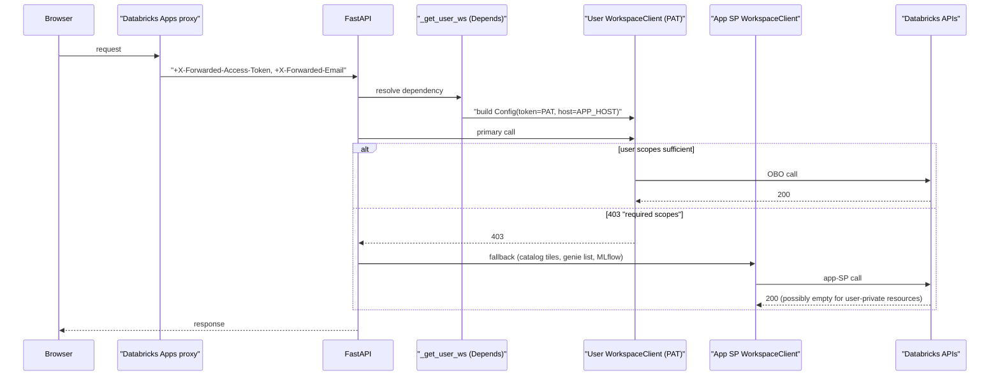

# OBO Authentication — Design Note

> **Audience:** Databricks Field Engineering / internal engineers maintaining
> Agent Hub. This is a working design note, not a customer-facing doc.
>
> **Scope:** How On-Behalf-Of (OBO) auth is implemented in this app today,
> the OBO-then-Service-Principal fallback pattern, current scope drift,
> and open follow-ups (with Slack evidence).
>
> **Status:** reflects `<your-profile>` prod as of 2026-04-17.

---

## 1. TL;DR

- **Two identities, two scopes:** each request carries *both* the app's
  service principal (SP) credentials (from env) *and* the caller's forwarded
  OAuth token (`X-Forwarded-Access-Token`). Routes prefer the user's token
  so Unity Catalog / endpoint permissions are enforced correctly.
- **Headers we use:** `X-Forwarded-Access-Token`, `X-Forwarded-Email`,
  `X-Forwarded-Preferred-Username`, `X-Forwarded-User`, `X-Forwarded-Host`,
  `X-Request-Id`. Parsed once in [_headers.py](../src/agent_hub/backend/core/_headers.py).
- **Scope model:** what the OBO token is *allowed* to do is declared in
  `app.yaml` (`user_authorization.scopes`) and `databricks.yml`
  (`user_api_scopes`). Those two lists are currently **out of sync** —
  see §8.
- **OBO → SP fallback pattern:** for a small set of read APIs
  (Agent Bricks tiles, Genie spaces list, MLflow model-version deps) we
  retry with the app SP client when OBO returns 403. This is a deliberate
  trade-off, not a bug — see §6.
- **What's broken on prod today:** Agent Bricks `/api/2.0/tiles` rejects
  our OBO token (`required scopes: ...` — the exact scope is not named in
  public docs). Classification works via the Agent Bricks naming fallback,
  but MAS/KA cards show raw endpoint names and sub-component breakdown is
  empty. Tracking in §10 and §11.

---

## 2. Identities at a glance

| Identity | Source | Where we use it | Typical failure mode |
|---|---|---|---|
| **App service principal (SP)** | `DATABRICKS_CLIENT_ID` / `DATABRICKS_CLIENT_SECRET` env vars (Databricks Apps runtime) → `app.state.workspace_client` in [_workspace.py](../src/agent_hub/backend/core/_workspace.py) | Background tasks, Lakebase schema migrations, UC introspection (model-version deps), fallback for read APIs whose OBO scope we don't have. | SP has broad but *app-level* permissions; user-private resources (e.g. Agent Bricks tiles) are invisible to it. |
| **User OBO** | `X-Forwarded-Access-Token` header set by the Apps proxy → `WorkspaceClient(Config(token=..., auth_type="pat"))` in `_get_user_ws` | All user-facing reads and the chat invocation path. | Forwarded token only carries the scopes declared in `user_api_scopes`; missing scope → 403. |

**Rule of thumb:** user scopes gate what the *forwarded* token can do; SP
scopes gate what the *app* can do on its own. Don't mix the two in one
call unless you're deliberately degrading (§6).

---

## 3. Request flow



---

## 4. HTTP headers used

All headers are set by the Databricks Apps reverse proxy
([public docs](https://docs.databricks.com/aws/en/dev-tools/databricks-apps/http-headers)).

| Header | Meaning | Used where |
|---|---|---|
| `X-Forwarded-Access-Token` | User's OAuth 2.0 access token, already downscoped to `user_api_scopes`. | `_get_user_ws` → PAT on `WorkspaceClient`. |
| `X-Forwarded-Email` | User email from IdP. | `_resolve_user_email` (RBAC, Lakebase row ownership). |
| `X-Forwarded-Preferred-Username` | IdP username (usually == email for us). | Parsed but not used directly today. |
| `X-Forwarded-User` | IdP user ID (opaque). | Parsed but not used directly today. |
| `X-Forwarded-Host` | Original request host. | Parsed but not used directly today. |
| `X-Request-Id` | Request UUID. | Parsed; useful for correlating logs if we wire structured logging. |

---

## 5. Backend implementation

### 5.1 Header parsing — [backend/core/_headers.py](../src/agent_hub/backend/core/_headers.py)

FastAPI uses the `Header` alias pattern to pull Databricks-proxied headers
into a typed model:

```26:41:src/agent_hub/backend/core/_headers.py
def get_databricks_headers(
    host: Annotated[str | None, Header(alias="X-Forwarded-Host")] = None,
    user_name: Annotated[str | None, Header(alias="X-Forwarded-Preferred-Username")] = None,
    user_id: Annotated[str | None, Header(alias="X-Forwarded-User")] = None,
    user_email: Annotated[str | None, Header(alias="X-Forwarded-Email")] = None,
    request_id: Annotated[str | None, Header(alias="X-Request-Id")] = None,
    token: Annotated[str | None, Header(alias="X-Forwarded-Access-Token")] = None,
) -> DatabricksAppsHeaders:
    return DatabricksAppsHeaders(
        host=host,
        user_name=user_name,
```

`token` is wrapped in `SecretStr` so it doesn't leak into repr output.

### 5.2 User WorkspaceClient build — [backend/core/_workspace.py](../src/agent_hub/backend/core/_workspace.py)

`_get_user_ws` is where the OBO token becomes a usable SDK client. Two
safeguards:

1. If the token is missing or obviously malformed, fall back to the app SP
   client (this is what allows local `apx dev` to work against a CLI
   profile).
2. Build `Config` **explicitly** with `client_id=None, client_secret=None`
   so the SDK's unified-auth resolver cannot accidentally pick up the
   DATABRICKS_CLIENT_ID/SECRET env vars that the Apps runtime injects. That
   env pair is for the *app's* SP, not the user — without this clear-out
   we'd silently degrade to SP auth.

```71:89:src/agent_hub/backend/core/_workspace.py
    # Reuse the app-level host so we don't accidentally resolve to a
    # different env-driven host. Build a Config explicitly so the SDK can't
    # silently fall back to the service principal's oauth-m2m creds picked
    # up from the DATABRICKS_CLIENT_ID / SECRET env vars in the app runtime.
    app_ws = request.app.state.workspace_client
    host = getattr(getattr(app_ws, "config", None), "host", None) or os.environ.get("DATABRICKS_HOST")
    cfg = Config(
        host=host,
        token=raw_token,
        auth_type="pat",
        client_id=None,
        client_secret=None,
    )
    return WorkspaceClient(config=cfg)


UserWorkspaceClientDependency: TypeAlias = Annotated[
    WorkspaceClient, Depends(_get_user_ws)
]
```

### 5.3 Email resolution — [backend/core/auth.py](../src/agent_hub/backend/core/auth.py)

```16:26:src/agent_hub/backend/core/auth.py
def _resolve_user_email(request: Request) -> str:
    """Extract the caller's email from Databricks Apps headers or workspace client."""
    email = request.headers.get("X-Forwarded-Email", "")
    if email:
        return email
    try:
        ws = request.app.state.workspace_client
        me = ws.current_user.me()
        return me.user_name or os.environ.get("USER", "anonymous")
```

Fallback chain: `X-Forwarded-Email` → `ws.current_user.me()` →
`os.environ["USER"]` → `"anonymous"`. Used by RBAC (first-admin bootstrap
in `_get_user_role`) and by Lakebase row ownership (`user_email` column on
`conversations` / `messages`).

### 5.4 Route injection — [backend/router.py](../src/agent_hub/backend/router.py)

Every user-facing route takes `UserWorkspaceClientDependency`; routes that
also need broader catalog introspection pull the SP separately from
`request.app.state`:

```121:156:src/agent_hub/backend/router.py
def get_agent(
    endpoint_name: str,
    request: Request,
    session: LakebaseDependency,
    user_ws: UserWorkspaceClientDependency,
) -> AgentDetailOut:
    # Use the OBO client for per-user checks; the SP client for UC
    # model-version introspection (needs broader catalog scope).
    sp_ws = request.app.state.workspace_client
    return catalog_service.get_agent_detail(endpoint_name, user_ws, session, sp_ws)
```

```164:174:src/agent_hub/backend/router.py
def list_genie_spaces(
    request: Request,
    user_ws: UserWorkspaceClientDependency,
) -> GenieSpaceListOut:
    """Read-through list of Genie Spaces the caller can see via OBO.

    Falls back to the app service principal when OBO lacks ``dashboards.genie``
    scope so admins can still populate the Genie tab.
    """
    sp_ws = request.app.state.workspace_client
    return catalog_service.list_genie_spaces(user_ws, sp_ws)
```

---

## 6. OBO → SP fallback pattern

**Why:** some Databricks read APIs require scopes that are either (a)
unnamed in public docs or (b) not exposable via `user_api_scopes` today.
Rather than surface 403s to users for read-only metadata, we retry the
call as the app SP. The SP has broad app-level perms and is a stable
identity for read-through.

**Where we use it:** [backend/services/catalog_service.py](../src/agent_hub/backend/services/catalog_service.py)
for tiles, MLflow model-version deps, and Genie spaces.

```79:94:src/agent_hub/backend/services/catalog_service.py
    candidates: list[tuple[str, WorkspaceClient]] = []
    if ws is not None:
        candidates.append(("obo", ws))
    if sp_ws is not None and sp_ws is not ws:
        candidates.append(("sp", sp_ws))

    resp: Any = None
    for label, client in candidates:
        try:
            resp = client.api_client.do("GET", "/api/2.0/tiles")
            logger.info("Tiles API lookup OK via %s", label)
            break
        except Exception as e:
            short = str(e).split("Config:")[0].strip()[:200]
            logger.warning("Tiles API lookup via %s failed: %s", label, short)
            continue
```

`list_genie_spaces` uses the same shape (see
[catalog_service.py](../src/agent_hub/backend/services/catalog_service.py#L1036)).

**When we explicitly do NOT fall back:** chat invocation. The user must
have access to the serving endpoint themselves — otherwise we'd be
leaking model output across users. See `_verify_access_best_effort`:

```144:158:src/agent_hub/backend/services/chat_service.py
def _verify_access_best_effort(endpoint_name: str, ws: WorkspaceClient) -> None:
    """Optional metadata read for observability only.

    OBO tokens may lack ``serving_endpoints.get`` scope while still allowing
    ``/invocations``. Real authorization is enforced by the serving layer on
    query, not by this preflight.
    """
    try:
        ws.serving_endpoints.get(endpoint_name)
    except Exception as e:
        logger.warning(
            "Skipping strict preflight for endpoint %s (proceeding to invocations): %s",
            endpoint_name,
            e,
        )
```

The invocation itself always uses the user's OBO token — the serving
layer will 403 independently if the user lacks `CAN QUERY`.

**Trade-off explicit in the doc:** SP fallback bypasses user RBAC for the
*one* call we retry. For tiles and MLflow deps this is OK because the
data is classification metadata, not user data. For Genie spaces it's
borderline — SP may see spaces the user can't; we accept this for catalog
discovery and rely on the Genie Space click-through enforcing access.
**Do not extend this pattern to any API that returns user data.**

---

## 7. Classification rule (colocated with auth because step 1 depends on scope)

Agent-type precedence in `_classify_agent_type`
([catalog_service.py §_classify_agent_type](../src/agent_hub/backend/services/catalog_service.py#L142)):

1. `tile.tile_type` from `/api/2.0/tiles` → `MAS` / `KA` *(source of truth,
   but unavailable on prod today — see F3)*.
2. `served_entity.external_model` set → `EXTERNAL`.
3. Agent Bricks naming convention: `mas-…-endpoint` → `MAS`, `ka-…-endpoint`
   → `KA`. Unambiguous — Databricks only auto-generates these names for
   Agent Bricks MAS / KA.
4. `task` field: `agent/v1/*` → `AGENT` (Custom Agent Endpoint),
   `llm/v1/*` / `embeddings` → `MODEL`.
5. Fallback → `MODEL`.

On prod today we skip step 1 (403) and rely on step 3. That gives the
correct type but not the friendly display name or sub-component list.

---

## 8. Scope configuration (current state)

### 8.1 `app.yaml` → `user_authorization.scopes`

```19:25:app.yaml
user_authorization:
  scopes:
    - serving.serving-endpoints
    - model-serving
    - iam.access-control:workspace
    - sql
    - dashboards.genie
```

### 8.2 `databricks.yml` → `resources.apps.agent_hub.user_api_scopes`

```62:66:databricks.yml
      user_api_scopes:
        - serving.serving-endpoints
        - sql
        - dashboards.genie
```

### 8.3 Drift

| Scope | `app.yaml` | `databricks.yml` | Notes |
|---|---|---|---|
| `serving.serving-endpoints` | yes | yes | OK. |
| `sql` | yes | yes | OK. |
| `dashboards.genie` | yes | yes | Works for `/api/2.0/genie/spaces` list when granted. |
| `iam.access-control:workspace` | yes | **no** | **Bundle-rejected (2026-04-17)** — tried to add to `databricks.yml`, got `"The specified scope iam.access-control:workspace is not a valid scope"`. Kept in `app.yaml` so it's re-added the moment the bundle accepts it. See F1. |
| `model-serving` | yes | **no** | Bundle-rejected — see F2. Same class as `iam.access-control:workspace`. |

The runtime truth is whatever `databricks bundle deploy` persists —
`app.yaml` does **not** override `databricks.yml`. Both files are kept in
sync at commit time for the scopes the bundle accepts;
`scripts/check_scopes.py` enforces this and treats the two
bundle-rejected scopes as accepted drift (with inline comments). When
the platform accepts either, remove it from the accepted-drift set and
add it to `databricks.yml`.

---

## 9. Local dev behavior

- `apx dev` does **not** synthesize `X-Forwarded-*` headers. Without the
  token header, `_get_user_ws` returns `app.state.workspace_client`,
  which is built from the CLI profile (`DATABRICKS_PROFILE=<your-profile>`).
- Email comes from `ws.current_user.me().user_name` via
  `_resolve_user_email`.
- Net effect: *every* local call runs as `<bootstrap-admin>`
  (or whoever is authed to the profile), with whatever scopes the profile
  token carries. This is why Agent Bricks tiles, UC introspection, etc.
  **work locally** but fail on prod — the CLI-profile token has broader
  scopes than the Apps-proxied OBO token.
- Implication: test parity is imperfect. Any feature that relies on an
  API that 403s under OBO will pass locally and fail in prod. The tiles
  API is the canonical example.

---

## 10. Known limitations & follow-ups

> All Slack links live in `databricks.slack.com/archives/<channel>/p<ts>`
> format. Hover them in the permalink appendix.

| ID | Issue | Evidence | Impact |
|---|---|---|---|
| **F1** | `databricks.yml` `user_api_scopes` is missing `iam.access-control:workspace` (and the invalid-but-aspirational `model-serving`) that `app.yaml` declares. **Update 2026-04-17:** tried to add `iam.access-control:workspace` to the bundle on the dev target; the Databricks CLI rejected it as *"The specified scope iam.access-control:workspace is not a valid scope"*. Same class as F2 — platform gap, not an app bug. `scripts/check_scopes.py` now treats both as accepted drift. Leave these scopes in `app.yaml` as aspirational; they will be re-added to `databricks.yml` once the CLI accepts them. | In-repo: `app.yaml` vs `databricks.yml`; dev deploy 2026-04-17 failure captured in [`es-tickets/tiles-api-scope.md`](es-tickets/tiles-api-scope.md) internal notes. | Cosmetic today; blocks us from getting tiles API and any future IAM-scoped calls through OBO. |
| **F2** | `model-serving` is rejected as *"not a valid scope"* in `user_api_scopes`, yet some serving endpoint calls expect it. Slack reports same symptom. | [#apa-apps p1775754820](https://databricks.slack.com/archives/C05E5R3F57B/p1775754820145389) | Today's OBO MAS calls ride on `serving.serving-endpoints`; if model-serving starts rejecting that, we inherit the outage. Pending Apps↔ModelServing scope reconciliation. |
| **F3** | Agent Bricks `/api/2.0/tiles` requires a scope we cannot name from public docs; OBO 403s on prod, SP sees 0 tiles because tiles are user-owned. **Prod verification 2026-04-17** confirmed the 403 message is generic (`"does not have required scopes"`) with **no scope name in the payload** — our structured logger correctly writes `required_scope=unknown`. The debug endpoint also confirms this is not an F5 gap (all declared scopes are in the token). | Prod app logs `"Tiles API lookup via obo failed: ... \| required_scope=<extracted or 'unknown'>"` (logging added 2026-04-17). Replay via `/api/v1/debug/me/scopes` (see §14). | MAS/KA cards show raw endpoint names; sub-component breakdown empty. Classification stays correct via naming fallback. ES ticket draft at [`es-tickets/tiles-api-scope.md`](es-tickets/tiles-api-scope.md) — updated with the `required_scope=unknown` finding. |
| **F4** | `unity-catalog` scope is not in the Apps allowlist (`AppsCommonConf.scala`); eng fix proposed but not shipped. | [#eng-databricks-apps p1776255993](https://databricks.slack.com/archives/C08CVK3UKP1/p1776255993507219) | Any future UC read-through via OBO will 403 until platform fix lands. |
| **F5** | Adding / removing scopes after the first app consent does **not** re-prompt the user; their forwarded token keeps the old scope set. | [#ai-bi-genie p1771479084](https://databricks.slack.com/archives/C05MUPAD9P0/p1771479084923509) | Whenever we change `user_api_scopes`, each user must re-authorize the app. No in-product notification today. |
| **F6** | `effective_user_api_scopes` in the app metadata can diverge from scopes actually embedded in the forwarded token. | [#canada-sa p1772178743](https://databricks.slack.com/archives/C0307JBT80L/p1772178743543129) | We trust app metadata when debugging; can mislead. Need token introspection to confirm. |
| **F7** | Vector Search OBO is not viable — `vectorsearch.vector-search-indexes` is not in the forwarded token even when declared. | [#apa-apps p1769011346](https://databricks.slack.com/archives/C05E5R3F57B/p1769011346907779) | We don't use VS today, but pre-empt: if we add it, must run through SP. |
| **F8** | `user_api_scopes` has no authoritative list of valid values; DAB / Terraform provider rejects some values inconsistently. | [#apa-apps p1776091361](https://databricks.slack.com/archives/C05E5R3F57B/p1776091361286869) | Empirical trial-and-error. |

---

## 11. Action items (prioritized)

| P | Action | Owner | Notes |
|---|---|---|---|
| P1 | ~~Add `iam.access-control:workspace` to `databricks.yml → user_api_scopes`.~~ **Attempted 2026-04-17, bundle rejected.** Captured as F1 platform gap. Committed the inline comment + accepted-drift entry in `scripts/check_scopes.py` so the next person trying this finds the prior art. Re-attempt when the platform accepts the scope. | App owner | |
| P1 | File a Databricks ES ticket asking for the OAuth scope name required by `GET /api/2.0/tiles` and whether it is exposable via `user_api_scopes`. Attach [#apa-apps p1775754820](https://databricks.slack.com/archives/C05E5R3F57B/p1775754820145389) and `app_id=agent-hub`. Draft lives at [`es-tickets/tiles-api-scope.md`](es-tickets/tiles-api-scope.md) — updated 2026-04-17 with prod-verified evidence (`required_scope=unknown`, SP returns 0 tiles, debug endpoint shows all declared scopes flowing). Ready to file. | App owner / FE | Addresses F3 root cause. |
| ~~P2~~ | ~~Add a `GET /api/v1/debug/me/scopes` endpoint that returns `effective_user_api_scopes` *and* introspects the forwarded token to list its real scopes. Admin-only.~~ **Done 2026-04-17** — see §14 runbook. Addresses F6. | App owner | |
| ~~P2~~ | ~~When the tiles API 403s, log one structured warning per discovery run with the exact scope name from the error body.~~ **Done 2026-04-17** — `_load_tiles_map` now emits `required_scope=…` from the error body. Addresses F3 observability. | App owner | |
| ~~P3~~ | ~~Add a deploy-time check script (`scripts/check_scopes.py`) that diffs `app.yaml` vs `databricks.yml` and prints a reminder about F5.~~ **Done 2026-04-17** — wired into README. | App owner | |
| P3 | When we adopt Vector Search or Unity Catalog read-through, design from day 1 with an SP path, not OBO. Document the RBAC trade-off inline. | Whoever adds the feature | Addresses F4, F7. |

---

## 12. Appendix A — Reference links

**Databricks public docs**

- [Configure authorization in a Databricks app](https://docs.databricks.com/aws/en/dev-tools/databricks-apps/auth)
- [Access HTTP headers passed to Databricks apps](https://docs.databricks.com/aws/en/dev-tools/databricks-apps/http-headers)
- [Databricks Apps authorization demo (GitHub)](https://github.com/databricks-solutions/databricks-apps-examples/tree/main/auth-demo)

**Internal Slack threads (credentials required)**

- MAS + `model-serving` scope mismatch — [#apa-apps p1775754820](https://databricks.slack.com/archives/C05E5R3F57B/p1775754820145389)
- `unity-catalog` not in Apps allowlist — [#eng-databricks-apps p1776255993](https://databricks.slack.com/archives/C08CVK3UKP1/p1776255993507219)
- Vector Search OBO workaround — [#apa-apps p1769011346](https://databricks.slack.com/archives/C05E5R3F57B/p1769011346907779)
- Consent-after-scope-change — [#ai-bi-genie p1771479084](https://databricks.slack.com/archives/C05MUPAD9P0/p1771479084923509)
- `sql` scope not forwarded despite being declared — [#canada-sa p1772177842](https://databricks.slack.com/archives/C0307JBT80L/p1772177842191579) · [#canada-sa p1772178743](https://databricks.slack.com/archives/C0307JBT80L/p1772178743543129)
- `user_api_scopes` validation gaps in DAB — [#apa-apps p1776091361](https://databricks.slack.com/archives/C05E5R3F57B/p1776091361286869)

**In-repo plan history**

- [docs/plans/phase-2-agent-catalog.md](plans/phase-2-agent-catalog.md)
- [docs/plans/phase-4-memory-system.md](plans/phase-4-memory-system.md)
- [docs/plans/phase-6-polish-and-deploy.md](plans/phase-6-polish-and-deploy.md)

---

## 13. Appendix B — File index

Touched by OBO auth in this repo:

| File | Role |
|---|---|
| [backend/core/_headers.py](../src/agent_hub/backend/core/_headers.py) | Parse `X-Forwarded-*` headers into a typed model. |
| [backend/core/_workspace.py](../src/agent_hub/backend/core/_workspace.py) | Build SP client at startup; build per-request OBO client via `_get_user_ws`. |
| [backend/core/auth.py](../src/agent_hub/backend/core/auth.py) | Email resolution and `require_role` RBAC. |
| [backend/router.py](../src/agent_hub/backend/router.py) | `UserWorkspaceClientDependency` injection on every user route. |
| [backend/services/catalog_service.py](../src/agent_hub/backend/services/catalog_service.py) | Tiles / Genie / MLflow OBO→SP fallback; classification precedence. |
| [backend/services/chat_service.py](../src/agent_hub/backend/services/chat_service.py) | `_verify_access_best_effort` — no SP fallback on invocation. |
| [backend/services/debug_service.py](../src/agent_hub/backend/services/debug_service.py) | Token scope introspection for `/api/v1/debug/me/scopes`. |
| [app.yaml](../app.yaml) | Declared user scopes (app manifest). |
| [databricks.yml](../databricks.yml) | Granted user scopes (bundle, deployed source of truth). |
| [scripts/check_scopes.py](../scripts/check_scopes.py) | Pre-deploy drift check + F5 reminder. |
| [docs/es-tickets/tiles-api-scope.md](es-tickets/tiles-api-scope.md) | Draft ES ticket for F3. |
| [docs/rollback-obo-gaps-2026-04-17.md](rollback-obo-gaps-2026-04-17.md) | Rollback runbook for the 2026-04-17 close-obo-gaps deploy (full + per-component). |

---

## 14. Debug runbook

Target audience: FE / engineers who have just hit a 403 from an OBO call
or noticed that tiles lookup / Genie listing is silently empty on prod.

### 14.1 Happy-path: confirm scopes are flowing

Gated by `require_debug_admin` — a diagnostic-only variant of
`require_role('admin')` that keeps working when Lakebase is down (which is
one of the scenarios this endpoint exists for). Order of checks:

1. Caller's forwarded email is in the `BOOTSTRAP_ADMIN_EMAILS` env
   (comma-separated, case-insensitive). Set this in `app.yaml` for the
   app owner(s) before first deploy.
2. Otherwise, if the DB is up, look up `user_roles` as normal.
3. Else 403 with a message pointing the operator at
   `BOOTSTRAP_ADMIN_EMAILS`.

Regular admin routes (agents visibility, settings, etc.) still use
`require_role('admin')` and require the DB — that's intentional, because
they mutate DB state.

```bash
# From the deployed Databricks App URL (picks up real X-Forwarded-* headers).
curl -sS \
  "$APP_URL/api/v1/debug/me/scopes" \
  -H "Cookie: $(your browser's session cookie)" \
  | jq
```

Expected on a freshly re-consented user (all scopes flowing):

```json
{
  "ok": true,
  "token_kind": "jwt",
  "declared": [
    "dashboards.genie",
    "iam.access-control:workspace",
    "serving.serving-endpoints",
    "sql"
  ],
  "in_token": [
    "dashboards.genie",
    "iam.access-control:workspace",
    "serving.serving-endpoints",
    "sql",
    "offline_access"
  ],
  "missing_from_token": [],
  "extra_in_token": ["offline_access"],
  "user_email": "alice@example.com",
  "app_name": "agent-hub",
  "notes": []
}
```

### 14.2 Field-by-field reading guide

| Field | Meaning | What to do if surprising |
|---|---|---|
| `ok` | `True` iff `declared ⊆ in_token`. | `False` → scopes missing in the user's token; see 14.3. |
| `token_kind` | `"jwt"` (decoded), `"opaque"` (couldn't decode), `"missing"` (no header). | `"opaque"` is expected for some deployments; rely on a real API call to confirm; see 14.4. `"missing"` + local dev is normal (see §9). |
| `declared` | What the app manifest claims the user granted — from `ws.apps.get(app_name).effective_user_api_scopes`. | Empty → `DATABRICKS_APP_NAME` env is unset, or no user has consented yet. |
| `in_token` | Scopes extracted from the forwarded token's `scope` / `scp` claim. | Null when token_kind ≠ "jwt". |
| `missing_from_token` | `declared \ in_token`. The list we most care about. | Each entry here will 403 when the code tries to use it. Remediation in 14.3. |
| `extra_in_token` | `in_token \ declared`. Usually harmless. | Typical: `offline_access`, old scopes the user consented to in a prior version. |
| `notes` | Diagnostic notes from the backend. | Usually explains why `in_token` is null or why the app lookup failed. |

### 14.3 `missing_from_token` is non-empty

**Root cause is almost always F5**: the user consented before we added
the scope, and Databricks does not re-prompt them.

1. Confirm the scope set was changed recently:

   ```bash
   python scripts/check_scopes.py
   # exit 2 means the snapshot changed -> F5 applies
   ```

2. Remediate for yourself first:
   - Go to **Account Settings → Apps**
   - Find `agent-hub`, click **Revoke**
   - Revisit the app URL; you should be shown a fresh consent screen.
   - Re-run `/api/v1/debug/me/scopes` → `missing_from_token` should be empty.

3. Communicate to all existing users that they must do the same.

4. After the rollout, update the snapshot:

   ```bash
   python scripts/check_scopes.py --update-snapshot
   ```

### 14.4 `token_kind == "opaque"`

Some Databricks deployments forward opaque bearer tokens that can't be
base64-decoded as JWTs. This is not a bug per se — it means we can't
list scopes client-side, and must infer grant status from actual API
calls.

1. Call a representative endpoint and look at the error:

   ```bash
   curl -i "$APP_URL/api/v1/agents/discover" -X POST \
     -H "Cookie: <session>"
   ```

2. If it 403s with `Provided OAuth token does not have required scopes:
   <name>`, cross-reference `<name>` to the `declared` list:
   - In `declared` → user needs to re-consent (F5).
   - Not in `declared` → the app manifest is missing a scope; add it to
     both `app.yaml` and `databricks.yml`, run the diff script,
     redeploy, update the snapshot, ask users to re-consent.

### 14.5 Tiles / Genie silently empty on prod

1. `grep "Tiles API lookup" <deployed app logs>`
2. Look for `required_scope=<name>` emitted by the new logging (P2b).
3. If `<name>` is something we can add to `user_api_scopes`: add to both
   `app.yaml` and `databricks.yml`, deploy, ask users to re-consent.
4. If `<name>` is something the bundle rejects (or "unknown"): attach it
   to the ES ticket draft at
   [`es-tickets/tiles-api-scope.md`](es-tickets/tiles-api-scope.md) and
   file it.

### 14.6 What the debug endpoint won't tell you

- **Endpoint-level permissions** (UC, serving endpoints, Genie Spaces).
  Scopes gate the *ability* to call an API; per-object ACLs gate *which
  objects* you see. `ok=true` + a 403 on an object call means a
  permission gap, not a scope gap.
- **Service principal scopes**. The SP path does not go through the
  `X-Forwarded-Access-Token`. If SP calls 403, check the SP's workspace
  role assignments (Databricks admin console → Identity and access).

### 14.7 History note — Genie Space catalog visibility (2026-04-17)

User-reported on 2026-04-17: only **1** Genie Space rendered in
`/catalog` despite OBO (`Listed 20 Genie Space(s)`) confirming 20 were
reachable. Investigation trail:

1. Suspected the default-visibility rule in `_default_visible_for`
   was hiding 19 rows in `catalog_config`.
2. Shipped a one-shot data migration
   (`migration_genie_default_visible_2026_04_17_v2`) to flip
   `visible=false` rows to `true`.
3. Migration ran idempotently on prod and touched **0 rows** — which
   proved the root cause was something else: `list_genie_spaces` is a
   direct pass-through to `/api/2.0/genie/spaces`, never persisted into
   `catalog_config`. So there were no DB rows to flip.
4. Re-verified post-deploy in-browser: all 20 Genie Spaces render
   correctly. The 1-of-20 state was therefore a **transient client-side
   state** (likely React-Query first-fetch race or browser cache), not
   a server-side filter bug.

Takeaways kept in the codebase:

- `_default_visible_for` now returns `True` for `AgentType.GENIE_SPACE`
  defensively. Currently a no-op, but correct if discovery ever starts
  persisting spaces (e.g. to give admins a hide-control for noisy
  test spaces).
- `_DATA_MIGRATIONS` scaffold + `admin_settings`-gated flag pattern is
  now in place for future one-shot fixes.
- `/admin/catalog` UI now documents the visibility defaults.
- Rollback steps for all three live in
  [`rollback-obo-gaps-2026-04-17.md`](rollback-obo-gaps-2026-04-17.md) §4.

### 14.8 History note — Catalog visibility + access fixes (2026-04-17, Deploy C)

Second follow-up the same day. Four user-reported issues — all distinct —
fixed in a single rollout. Rollback steps are in
[`rollback-obo-gaps-2026-04-17.md`](rollback-obo-gaps-2026-04-17.md) §5.

1. **Genie Spaces didn't appear on `/admin/catalog`.** Root cause:
   `admin_service.list_catalog_entries` reads exclusively from
   `catalog_config`, and §14.7 confirmed Genie Spaces were never
   persisted there. Fix: `discover_from_workspace` now upserts every
   reachable space under a `genie:<space_id>` namespace, and
   `list_genie_spaces` persist-on-reads for newly-seen spaces so
   admins don't have to press *Discover* first. `list_agents` skips
   `genie:*` rows so the end-user catalog doesn't double-render them.
2. **Owners denied access to their own agents.** Root cause: the
   970-byte OBO token (F5 stale-consent variant) intermittently returns
   "unable to parse response" from `serving_endpoints.get()`, which we
   treated as no-access. Fix: conservative owner fallback — if the OBO
   probe fails **and** `user_email == owner_email` on the `catalog_config`
   row, grant access with `permission_level="OWNER"`. Non-owners are
   unaffected; see `_owner_has_access()` and its unit tests.
3. **`Listing serving endpoints...` with no follow-up log line.** Root
   cause: `ws.serving_endpoints.list()` hangs silently under the same
   bad-token variant. Fix: `_list_serving_endpoints_resilient` wraps the
   call with OBO→SP fallback and structured timing (`Listed N serving
   endpoint(s) via {obo|sp} in Xms`). Same pattern we already use for
   Tiles and Genie.
4. **MAS rows showed raw endpoint names** (`mas-94fa1c3b-endpoint`).
   Root cause: Tiles API returns 0 tiles (F3) → `display_name` fell
   through to the raw endpoint. Fix: `_derive_display_name(tile →
   uc_model → prettified endpoint)` + `_smart_title` that preserves
   hex-looking tokens so `Mas 94fa1c3b` stays readable.

The 970-byte-token parse error is another observable symptom of F5
(stale consent) and should be captured in ES when we open the
customer-facing follow-up: same user, same app, different session →
different token behaviour. Force a re-consent via `/debug/me/scopes`
or revoke-and-reauthorize to recover.

### 14.9 History note — Streaming + instant sidebar (2026-04-09, Deploy D)

UX-only follow-up. **OBO is unchanged**: the streaming path reuses the
same `ws.config.token` (OBO `X-Forwarded-Access-Token`) as a raw
`Authorization: Bearer …` header on an `httpx.Client.send(..., stream=True)`
call to `/serving-endpoints/{name}/invocations`. No scope changes, no
consent re-prompt, no new env vars. The two user-visible changes:

1. **Real token-by-token streaming.** Replaced `ws.api_client.do` (which
   buffered the entire response despite `stream:true`) with raw
   `httpx` + `iter_lines()` + `_iter_sse_lines` parser. The
   `messages`→`input` body retry is preserved for MAS endpoints.
2. **Instant conversation sidebar + URL flip.** The backend now emits
   `data: {"type":"started","conversation_id":"…"}` the moment the
   conversation row + user message are persisted. The frontend handles
   it by calling `setConversationId` + `invalidateQueries(listConversationsKey())`,
   and `/chat/new` mounts `ConversationSidebar` on first render so
   there's no empty-pane gap before the response lands.

Rollback steps (three independent hunks, no DB migration, no scope
changes) live in
[`rollback-obo-gaps-2026-04-17.md`](rollback-obo-gaps-2026-04-17.md) §6.

### 14.10 History note — Genie in-app chat + simulated streaming (2026-04-09, Deploy E)

Two-part follow-up to Deploy D, again **OBO-neutral** (same forwarded
token, same `dashboards.genie` scope already declared, no new env vars,
no consent re-prompt):

1. **Genie Spaces are first-class chatable agents.** `chat_service`
   detects the `genie:<space_id>` synthetic endpoint name (introduced
   by Deploy C's persistence path) and dispatches to a new
   `_stream_genie` branch that drives the Genie Conversation API
   (`start-conversation` / `messages` / poll-`messages/{id}` for
   status). Status transitions are emitted as italicized tokens
   (`_Generating SQL..._`, `_Running query..._`); the final
   `COMPLETED` message is rendered as natural-language text plus a
   fenced ```sql block. Genie's per-turn `conversation_id` is
   persisted on the row in `conversations.metadata_json->>'genie_conversation_id'`
   so follow-ups thread correctly. The frontend swap is small —
   `genie-space-card.tsx` now uses an in-app `<Link>` instead of an
   external `<a>`, and the access check in `catalog_service` uses a
   new `_genie_has_access(space_id)` probe (`GET /api/2.0/genie/spaces/{id}`)
   with the existing owner fallback.
2. **Streaming UX restored.** Two complementary fixes:
   - `_post_stream` now sends `Accept: text/event-stream` (no JSON
     fallback in the streaming POST's Accept) to give upstreams a
     stronger streaming hint.
   - When the upstream still returns a single `application/json`
     payload (or when streaming raises and we fall back to
     `_query_endpoint`), a new word-boundary-aware
     `_simulate_chunked_stream` helper splits the result into ~12-char
     chunks with a 20ms delay so the UI sees progressive tokens
     instead of a freeze + dump. Logs show `Simulated chunked stream
     applied for <ep> (chars=N)` and `Upstream returned
     application/json (one-shot); applying simulated chunking
     (chars=N)` so deploys can tell which branch ran.

   The frontend `chat.new.tsx` no longer calls `navigate(...)` on the
   `started` event — that was unmounting the route, killing the live
   `EventSource`, and resetting `chat.messages` to `[]` (which is what
   made streaming "look" broken end-to-end). Replaced with
   `window.history.replaceState({}, "", target)` so the URL flips in
   place; the `EventSource` survives, and the new conversation
   highlights instantly via `activeId={chat.conversationId}` on
   `ConversationSidebar`. `chat.$conversationId.tsx` skips re-seeding
   messages from `convDetail` while `chat.isStreaming` is true to
   avoid the same race.

DB migration is a single `ALTER TABLE conversations ADD COLUMN IF NOT
EXISTS metadata_json JSONB`, idempotent and a no-op for non-Genie
conversations. Rollback steps (each fix independently revertable) live
in [`rollback-obo-gaps-2026-04-17.md`](rollback-obo-gaps-2026-04-17.md) §7.

---

## 15. UC-tag driven agent types (Phase 1 of the agent-type roadmap)

**Ticket**: Master roadmap — agent types, chat invocation, iOS redesign
(Phase 1). **Status**: Delivered — discovery + catalog visibility. Chat
invocation for the new types remains a stub (see §16, Phase 2).

### 15.1 What Phase 1 adds

Two new `AgentType` values — **`HTTP_CONNECTION`** and
**`MCP_ENDPOINT`** — and a Unity Catalog tag-driven discovery path that
surfaces them in the catalog:

| Type | Prefix in `catalog_config.endpoint_name` | Source | Chat today |
|---|---|---|---|
| `HTTP_CONNECTION` | `uc:<catalog>.<schema>.<fn>` or `uc:<catalog>.<conn>` | tagged UC function / Connection | Phase-1 stub SSE |
| `MCP_ENDPOINT` | `mcp:<catalog>.<schema>.<fn>` or `mcp:<catalog>.<conn>` | tagged UC function / Connection with `kind=mcp` | Phase-1 stub SSE |

The existing `genie:<space_id>` convention is unchanged.

### 15.2 Tag convention

Admins configure three tag keys via `GET`/`PUT /admin/tag-config`
(persisted in `admin_settings.uc_tag_config`):

- `agent_tag_key` (default `agent_hub_role`) — tag name that marks
  a UC object as a hub agent.
- `agent_tag_value` (default `agent`) — the value the tag must hold.
- `agent_kind_tag_key` (default `agent_hub_kind`) — optional tag
  whose value is `http` or `mcp` and disambiguates the two new types.
  If absent, functions default to `HTTP_CONNECTION` and connections
  default to `MCP_ENDPOINT` (matches the common case where UC
  Connections are used for managed MCP endpoints).

### 15.3 Discovery — why the SP client

Tag lookup reads `system.information_schema.function_tags` and
`system.information_schema.connection_tags` via
`POST /api/2.0/sql/statements` on the admin warehouse. These `*_tags`
views are owned by the metastore admin and **cannot be read under the
end-user's OBO token** in practice — reads return empty result sets even
when the user can otherwise see the tagged objects. We therefore call
them through the **SP workspace client** (same pattern we use for Tiles,
see §5.6), with the admin warehouse resolved from
`AGENT_HUB_ADMIN_WAREHOUSE_ID` (falling back to `DATABRICKS_WAREHOUSE_ID`).

Only read-only, catalog-metadata queries cross the SP trust boundary
here. No row-level data flows through the SP. The discovery pass upserts
summaries into `catalog_config` and returns; every subsequent user-facing
read goes back through OBO.

### 15.4 Access checks for `uc:*` / `mcp:*`

`get_agent_detail` and `check_access` short-circuit for UC / MCP rows
because `serving_endpoints.get` would always 404:

- `get_agent_detail` returns `has_access=True` with no sub-agent
  introspection — Phase 1 treats discovery itself as proof of
  catalog-level visibility.
- `check_access` returns `permission_level="OWNER"` when
  `_owner_has_access` matches (same conservative owner fallback as
  §5.4) and `"CAN_USE_DEFERRED"` otherwise. The name is intentional —
  Phase 2 will add a per-invocation `has_privilege('EXECUTE', ...)`
  probe before each chat call, which is the real authorization gate.

The `reclassify_existing` helper and `_verify_access_best_effort` now
skip `uc:*` / `mcp:*` prefixes (alongside the existing `genie:*`
skip) so the ad-hoc endpoint preflight never floods the logs with 404s.

### 15.5 `stream_chat` stub

`stream_chat` detects `uc:*` / `mcp:*` after the `started` event and
emits a single friendly `token` SSE explaining Phase-2 arrival, then
`done`. The message references the full UC name so ops can find the
object quickly. Phase 2 replaces this branch with `_stream_http_connection`
and `_stream_mcp`; rollback is the same `AGENT_HUB_DISABLE_UC_MCP_CHAT=1`
flag (see rollback doc Deploy G).

### 15.6 Operator checklist per deploy

1. Ensure `AGENT_HUB_ADMIN_WAREHOUSE_ID` is set (or `DATABRICKS_WAREHOUSE_ID`
   exists in the app runtime). Without it, UC-tag discovery logs a
   warning and skips — no error.
2. Run `POST /agents/discover` once and check the logs for
   `catalog.uc_discovery fn=... mcp_fn=... conn=... created=... updated=... warehouse=...`.
3. Run `uv run python scripts/audit_agent_types.py` to confirm every
   `catalog_config` row's prefix agrees with its persisted `agent_type`.
   Non-zero exit means a row was hand-edited or an older code path left
   a mismatch; re-running discover usually fixes it.
4. Click through the catalog filter chips — `HTTP Connection` and
   `MCP Endpoint` must appear once tagged objects are present.
5. Open one of the new agents and send a chat message — expect the
   Phase-2 notice, not a 500.

### 15.7 Feature flags

- `AGENT_HUB_DISABLE_UC_MCP_DISCOVERY=1` → discovery skips the UC-tag pass
  entirely (used when `*_tags` views misbehave in a new region).
- `AGENT_HUB_ADMIN_WAREHOUSE_ID` unset → discovery skips with a visible
  warning returned from `POST /agents/discover`.
- Rollback SQL to clear the two new types: see rollback doc §8.

---

## 16. UC HTTP + MCP chat invocation (Phase 2 of the agent-type roadmap)

### 16.1 What Phase 2 adds

Phase 1 surfaced `uc:*` (HTTP Connection) and `mcp:*` (MCP Endpoint) rows
in the catalog but chat was a polite stub. Phase 2 ships real streaming
for both. Everything else in the app is unchanged; the Phase 1 stub path
is preserved behind `AGENT_HUB_DISABLE_UC_MCP_CHAT=1` so rollback is a single
env var and an app redeploy.

Shipped in [chat_service.py](../src/agent_hub/backend/services/chat_service.py):

- `_stream_http_connection` — dispatches on `invoke_shape`:
  - `uc_function_sql` → `SELECT full_name(?)` via the SQL Statements REST
    API (`POST /api/2.0/sql/statements`) using the **SP client** against
    the admin warehouse. OBO is used first for a `has_privilege` probe;
    enforcement is still delegated to the warehouse + UC at execution.
  - `uc_connection_http` → `SELECT system.ai.http_request(conn => '...',
    method => 'POST', body => parse_json(?))` with the same SP +
    warehouse pattern.
  - Results are streamed via `_simulate_chunked_stream`; JSON bodies are
    unwrapped to a human-friendly text field when one is present.
- `_stream_mcp` — opens a JSON-RPC over streamable-HTTP session:
  - URL + bearer resolve from catalog metadata first, then from UC
    Connection options (via `sp_ws.connections.get` with a `DESCRIBE
    CONNECTION EXTENDED` fallback), then from `DATABRICKS_MCP_MANAGED_*`
    env vars when the agent is Databricks-managed.
  - Calls `initialize` + `tools/list`, caches the tool list inside
    `conversations.metadata_json.mcp_tools` per conversation.
  - Picks a default tool by convention (`chat` / `ask` / `run` / sole
    tool). Ambiguity emits a `needs_tool_choice` SSE event; the UI
    renders a picker and resubmits with `tool_choice` set — the backend
    persists the choice against the conversation for subsequent turns.
  - Calls `tools/call`, emits `tool_call` / `tool_result` / streamed
    `token` / `done` events.

### 16.2 Why the SP client (again)

Same reason as Phase 1 discovery: OBO tokens issued to the app rarely
include the scope needed to execute statements against an arbitrary UC
function or to describe a UC connection. The Phase 2 invocation path
keeps the **access check** on OBO (`has_privilege('EXECUTE','FUNCTION',
full_name)`) and routes the **execution** through the SP. This gives
the user a crisp 403 when they clearly lack EXECUTE, while still
enforcing the real UC grant at statement-run time.

### 16.3 MCP authentication

Three cases, resolved in this priority order:

1. **Cached metadata** (from Phase 1 discovery) — `metadata.mcp.url`
   and optional `metadata.mcp.bearer` are used directly.
2. **UC Connection** (`invoke_shape=mcp_connection`) — SP fetches the
   connection options via `connections.get`, reads `host` / `base_url`
   / `url` for the URL and `bearer_token` / `access_token` / `token` /
   `api_key` for the bearer. Options are **never logged**.
3. **Databricks-managed MCP** — `DATABRICKS_MCP_MANAGED_URL` +
   `DATABRICKS_MCP_MANAGED_TOKEN` env vars; if `TOKEN` is absent we
   fall through to the user's `X-Forwarded-Access-Token`, which mirrors
   the OBO story on the public `/api/2.0/mcp/*` endpoints.

### 16.4 SSE event contract

| Event                | Payload                                                |
| -------------------- | ------------------------------------------------------ |
| `started`            | `conversation_id` (first event on every turn)          |
| `token`              | `token: string`, `done: false`                         |
| `tool_call`          | `name: string`, `input: object`, `done: false`         |
| `tool_result`        | `name: string`, `is_error: bool`, `done: false`        |
| `needs_tool_choice`  | `tools: [{name, description, inputSchema}]`            |
| `done`               | `conversation_id`, `done: true`                        |
| `error`              | `error: string`, `done: true`                          |

Everything new in Phase 2 is purely **additive** — the MAS / Genie
paths already in prod never emit `tool_call`, `tool_result`, or
`needs_tool_choice`, and the UI reducer ignores events it doesn't
recognize.

### 16.5 Observability

Every HTTP / MCP chat turn logs a structured line (no request or
response bodies — just shape and latency):

- `chat.uc_http start endpoint=... shape=... full_name=...`
- `chat.uc_http ok    endpoint=... shape=... elapsed_ms=... chars=...`
- `chat.mcp     start endpoint=... transport=... url_host=...`
- `chat.mcp     ok    endpoint=... tool=... elapsed_ms=... chars=...`
- `chat.mcp     tool_call_failed endpoint=... tool=... elapsed_ms=...`

### 16.6 Operator checklist per deploy

1. Deploy Phase 2 to `<your-profile>` dev with `AGENT_HUB_DISABLE_UC_MCP_CHAT`
   **unset** and confirm the catalog still shows Phase 1's UC/MCP
   rows.
2. Pick one `uc:` agent and send a prompt — expect a `running` status
   update, then a streamed answer. Spot-check the new structured log
   lines in `oneenv` logs.
3. Pick one `mcp:` agent (managed + external) — confirm a `tool_call`
   card appears mid-stream and the answer streams after.
4. Set `AGENT_HUB_DISABLE_UC_MCP_CHAT=1`, redeploy, confirm the Phase 1
   stub returns. Flip it off again.
5. Promote to prod once the above steps pass.

### 16.7 Feature flags

- `AGENT_HUB_DISABLE_UC_MCP_CHAT=1` → re-routes every `uc:*` / `mcp:*`
  chat turn back to the Phase 1 notice stub. Frontend is unaffected;
  tool-call UI components simply never receive their events.
- `DATABRICKS_MCP_MANAGED_URL` / `DATABRICKS_MCP_MANAGED_TOKEN` →
  opt-in managed MCP host; omit both to disable managed MCP entirely.
- See rollback doc §9 (Deploy G) for the full revert procedure.

---
